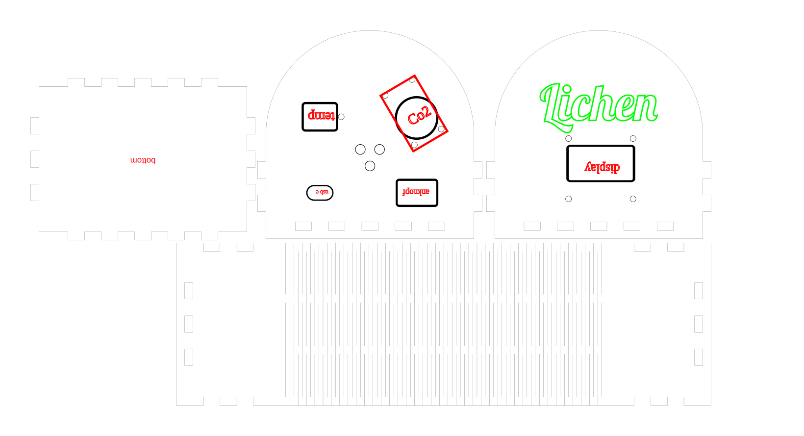

# Lichen case

Lasercut enclosure for the Lichen sensor unit — MQ135 air quality sensor, DHT11
temperature/humidity sensor, OLED display, power switch, USB-C.



An arched box: flat-topped semicircular front and back panels, wrapped by a single
band that bends around the arch on a lattice living hinge, closed by a bottom plate.
Four parts, 24 finger joints, one 377 × 200 mm sheet of **4 mm plywood**.

## Cutting

**`cut/lichen_sept_9_v4.svg`** is the file. One sheet gives a complete case.

| colour | |
|---|---|
| **black** | cut |
| **green** | engrave — the logo |
| **red** | ignore — placement markers and working labels, not features |

Anything in `archive/` is superseded; don't cut from it.

## Fit

Joint clearance is kerf-compensated; boxes.py calls the per-side amount `burn`. The
two directions behave differently:

```
width     (finger direction)  closes by  4*burn - 2*kerf   both parts move toward each other
thickness (board direction)   closes by  2*burn -   kerf   only the slot moves, the board is fixed
```

For a given burn the thickness direction ends up tighter, and unlike the width it has
no give — so it is left uncompensated at 4.00 throughout.

| feature | burn | drawn |
|---|---|---|
| panel tabs / shell notches | 0.08 | 8.16 / 7.84 |
| the 16 finger holes (width) | 0.08 | 7.84 |
| bottom plate tabs | 0.00 | 8.00 — deliberately loose |
| thickness dimension | — | 4.00 |

The bottom plate is loose on purpose: it is captured on four sides and glued, so there
is nothing to gain from a tight fit.

Sensor cutouts were fitted by hand against real parts and carry no kerf compensation.

## Calibrating for your machine

`calibration/lichen_fit_test_min.svg` (266 × 96 mm) sweeps burn 0.000 → 0.250 across
matched tab/socket pairs, and measures your kerf and real board thickness. Cut it in
the material you'll use — both move with the stock. It engraves in blue, unlike the
case files.

Read the result as a starting point and expect to go a step looser. Two tabs pushed
together by hand feel firmer than the same fit does across 24 joints going together at
once, so the coupon tends to flatter a tight setting.

This case as a worked example: on the coupon 0.075 felt sloppy and **0.1 felt right**,
so 0.1 is what got cut. Assembled, it was too tight — the ply cracked around the joints
as the parts went home. The case now uses **0.08**, one step looser than the coupon
chose, and the bottom plate is at **0.00** because a loose fit there costs nothing. If
your coupon lands on a value, consider the next one down.

## Layout

```
cut/          the sheet to cut
calibration/  fit-test sheets
archive/      superseded revisions and earlier design iterations
CLAUDE.md     geometry, joint inventory, and the file's hand-edit quirks
preview.png   render of the full sheet
```

## Licence

[CC BY 4.0](LICENSE) — attribution required, everything else permitted. The
Lichen name and logo are not covered (CC BY does not license trademarks).

Generated with [Boxes.py](https://github.com/florianfesti/boxes) and hand-edited;
per its FAQ the generated drawings carry no GPL obligation.
